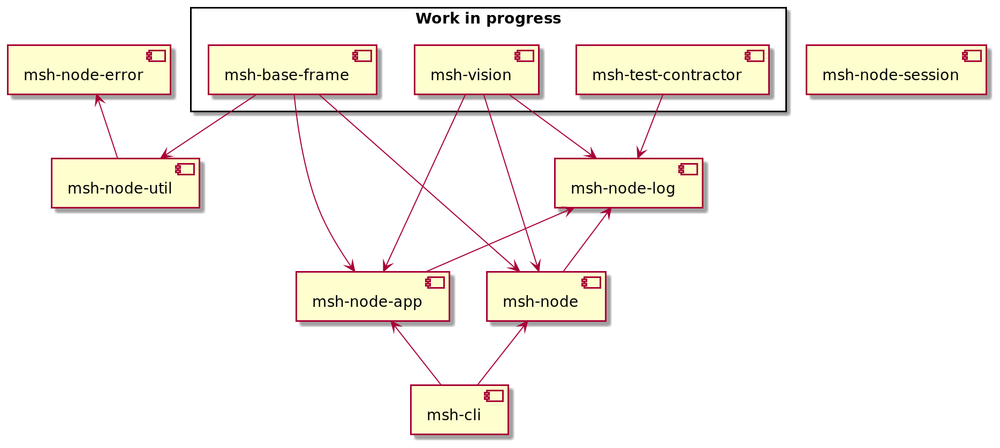

# MSH (Micro-Service Helper)

## Idea

The idea behind MSH is a set of tools mimicking a framework in decoupling manner (Micro-Framework).

It is written to be used in Typescript/Node.js projects (and can also be used in web projects)

## List of tools

* [msh-cli](https://github.com/beecode-rs/msh-cli) - helps with managing multi repo project
* [msh-node-app](https://github.com/beecode-rs/msh-node-app) - app initialization abstraction, app creation/destruction flow control
* [msh-node-env](https://github.com/beecode-rs/msh-node-env) - env variable extraction with validation
* [msh-node-error](https://github.com/beecode-rs/msh-node-error) - error collection
* [msh-node-log](https://github.com/beecode-rs/msh-node-log) - log abstraction
* [msh-node-session](https://github.com/beecode-rs/msh-node-session) - cls-hooked wrapper
* [msh-node-util](https://github.com/beecode-rs/msh-node-util) - useful functions

### Work in progress
 
* [msh-base-frame](https://github.com/beecode-rs/msh-base-frame) - simplify yeoman, used for setup and updating projects
* [msh-vision](https://github.com/beecode-rs/msh-vision) - visualizing code structure
* [msh-test-contractor](https://github.com/beecode-rs/msh-test-contractor) - using contracts to achieve integration test functionality by using only unit tests

## Project relations

