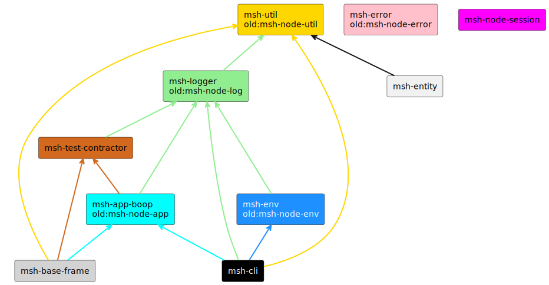

# MSH (Micro-Service Helper)

## Idea

The idea behind MSH is a set of tools mimicking a framework in decoupling manner (Micro-Framework).

It is written to be used in Typescript/Node.js projects (and can also be used in web projects)

## List of tools

- [msh-cli](https://github.com/beecode-rs/msh-cli)  - helps with managing multi repo project
- [msh-node-app](https://github.com/beecode-rs/msh-node-app)  - app initialization abstraction, app creation/destruction flow control
- [msh-node-session](https://github.com/beecode-rs/msh-node-session)  - cls-hooked wrapper
- [msh-logger](https://github.com/beecode-rs/msh-logger)  - log abstraction
  - [old] [msh-node-log](https://github.com/beecode-rs/msh-node-log)  - log abstraction
- [msh-error](https://github.com/beecode-rs/msh-error)  - error collection
  - [old] [msh-node-error](https://github.com/beecode-rs/msh-node-error)  - error collection
- [msh-env](https://github.com/beecode-rs/msh-env)  - env variable extraction with validation
  - [old] [msh-node-env](https://github.com/beecode-rs/msh-node-env)  - env variable extraction with validation
- [msh-util](https://github.com/beecode-rs/msh-util)  - useful functions
  - [old] [msh-node-util](https://github.com/beecode-rs/msh-node-util)  - useful functions

### Work in progress

- [msh-base-frame](https://github.com/beecode-rs/msh-base-frame)  - simplify yeoman, used for setup and updating projects
- [msh-test-contractor](https://github.com/beecode-rs/msh-test-contractor)  - using contracts to achieve integration test functionality by using only unit tests

## Project relations

